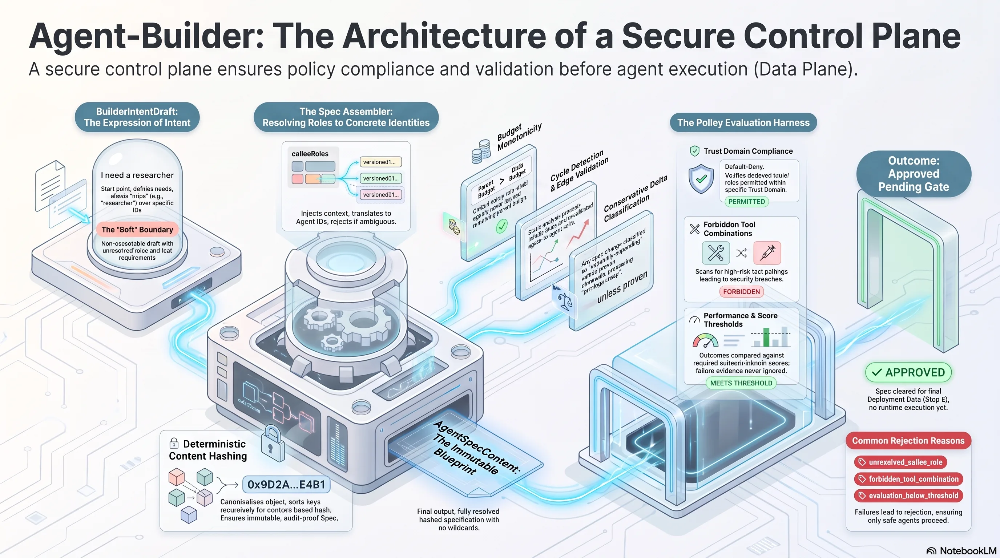

# agent-builder

`agent-builder` is a TypeScript prototype for a control-plane-first builder agent.
Its job is not to execute agents directly. It turns builder intent into validated,
versioned agent specifications, evaluates them against policy, and produces auditable
approval decisions without deploying or executing the resulting agents.

The core boundary is:

> The Builder Agent proposes specs. The Control Plane grants capabilities, edges,
> and lifecycle states. The Data Plane executes only approved, versioned bindings.

## Architecture



The implemented control-plane flow is:

```text
BuilderIntentDraft
  -> Spec Assembler
  -> immutable AgentSpecContent
  -> Policy / Evaluation Harness
  -> Deployment Gate
  -> approved or rejected lifecycle metadata + audit artifact
```

The flow stops at `approved`. Runtime deployment and agent execution belong to the
future Data Plane and are intentionally outside this package's current scope.

## What Is Implemented

- Zod schemas for control-plane artifacts:
  - `BuilderIntentDraft`
  - `AgentSpecContent`
  - `AgentSpecRuntimeMetadata`
  - `AgentCallPolicyEdge`
  - `TrustDomain`
  - `ApprovalArtifact`
  - `CallContext`
- A pure spec assembler that:
  - validates builder drafts at the trust boundary
  - resolves requested callee roles to concrete approved spec versions
  - assigns the next immutable version
  - computes a deterministic content hash
- A policy harness that:
  - rejects forbidden tool combinations
  - checks trust-domain membership
  - classifies capability deltas
  - requires evaluation for initial or capability-expanding specs
  - binds every decision to the evaluated spec ID, version, and content hash
  - validates evaluation outcomes and retains decision evidence
- A deployment gate that:
  - accepts only specs in the `in_review` lifecycle state
  - verifies candidate, policy subject, and runtime metadata refer to the same spec
  - enforces separation of duties between requestor and approver
  - emits schema-validated approval evidence and lifecycle transitions
  - fails closed when required evaluation evidence is missing
- Runtime/control invariants for:
  - executable-boundary checks
  - call-graph cycle detection
  - budget monotonicity across call chains
  - capability delta classification

See [docs/architecture/agent-builder-control-plane.md](docs/architecture/agent-builder-control-plane.md)
for the architecture and rejected shortcuts.

## Repository Layout

```text
src/
  assembler/    Draft-to-spec assembly and role resolution
  gate/         Approval decisions and lifecycle transitions
  harness/      Policy and evaluation decisions
  invariants/   Cross-cutting control-plane invariants
  schema/       Zod schemas and exported TypeScript types
tests/
  assembler/    Assembly behavior
  gate/         Deployment-gate behavior
  harness/      Policy decision behavior
  invariants/   Invariant checks
  schema/       Schema validation behavior
docs/
  architecture/ Control-plane design notes
```

`docs/learning/` is treated as local generated learning material and is ignored
for new files, except for the architecture diagram embedded in this README.

## Requirements

- Node.js
- pnpm 11.16.0, as declared in `package.json`

Install dependencies:

```bash
pnpm install
```

## Development

Run the test suite:

```bash
pnpm test
```

Run TypeScript checks:

```bash
pnpm typecheck
```

Run tests in watch mode:

```bash
pnpm test:watch
```

## Design Constraints

This package intentionally keeps several capabilities out of scope:

- no direct deployment by the Builder Agent
- no executable specs
- no wildcard tool or agent-call grants
- no unresolved role expressions in final `AgentSpecContent`
- no global/shared credentials
- no agent-to-agent calls without explicit approved edges
- no evaluation shortcut for "simple" agents
- no approval directly from the `draft` lifecycle state
- no self-approval by the spec requestor
- no approval without policy-subject and content-hash binding
- no runtime budget increases along a call chain

These constraints are enforced in code where the current prototype has enough local
context, and documented as control-plane requirements where a future registry,
deployment executor, or runtime harness is needed.
